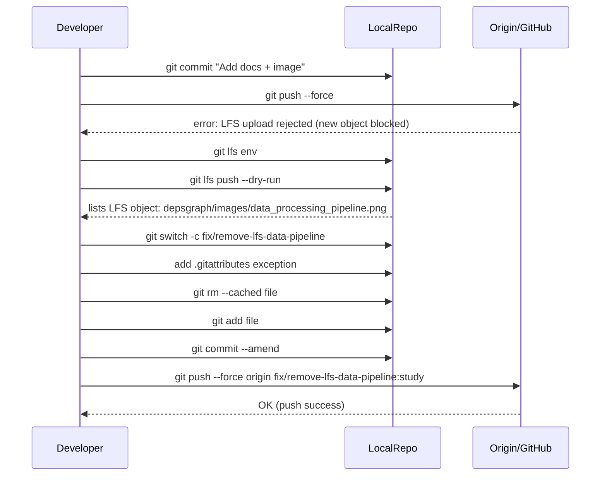

# LFS Push Failure — Diagnosis and Resolution

> Summary — Issue recorded: git push failed when uploading LFS objects for a forked remote.


## 🚨 Problem — End-user push failed

- You ran: `git push --force` (from branch `study`) and push failed with:

  > "batch response: @satishgoda can not upload new objects to public fork"

- Git error: `error: failed to push some refs to 'https://github.com/satishgoda/blender.git'`

- git-lfs attempted to upload a new object; the remote rejected the upload.


---


## 🔍 Why it occurred

- The repository’s `.gitattributes` tracks `*.png` with LFS globally.

- A small PNG was added: `study/source/blender/depsgraph/images/data_processing_pipeline.png` (~188 KB).

- Git attempted to upload the new LFS object to the forked repository (`satishgoda/blender`), but GitHub’s fork policy or permissions prevented creating new LFS objects on that fork.

- The push aborted due to the LFS upload rejection.


---


## 🛠 Diagnosis & commands used

- Inspect remotes and LFS configuration:


```bash
git remote -v

git lfs env
```

- See what LFS objects would be pushed (dry-run):


```bash
git lfs push --dry-run origin study
```

- Identify which file was tracked in LFS:


```bash
git lfs ls-files --all | grep data_processing_pipeline.png
```

- Confirm `.gitattributes` behavior for that file:


```bash
git check-attr filter -- study/source/blender/depsgraph/images/data_processing_pipeline.png
```


---


## ✅ Resolution (short)

- Converted the PNG to a non-LFS object by creating a per-file `.gitattributes` exception and re-adding it to the index.

- Procedure:

  1. `echo 'study/source/blender/depsgraph/images/data_processing_pipeline.png -filter' >> .gitattributes`
  2. `git add .gitattributes`
  3. `git rm --cached study/source/blender/depsgraph/images/data_processing_pipeline.png`
  4. `git add study/source/blender/depsgraph/images/data_processing_pipeline.png`
  5. `git commit --amend --no-edit`
  6. `git push --force origin fix/remove-lfs-data-pipeline:study` (or push the amended commit to the branch)

- Result: Push succeeded without attempting to upload the LFS object.


---


## Commands executed (summary table)


| Stage | Commands | Purpose |
|---|---|---|
| Inspect remotes & LFS | `git remote -v` / `git lfs env` | Show remotes & LFS endpoints |
| Check pending LFS | `git lfs push --dry-run origin study` | List LFS objects waiting to upload |
| Check .gitattributes | `git lfs track` / `git check-attr filter -- <file>` | Confirm PNG is tracked via LFS |
| Convert PNG to non-LFS | `echo 'file -filter' >> .gitattributes` / `git rm --cached file` / `git add file` / `git commit --amend` | Remove LFS tracking for specific file |
| Push branch | `git push --force origin fix/remove-lfs-data-pipeline:study` | Replace commit so file is not LFS-tracked |


---


## Flowchart — Decision flow


```mermaid
flowchart LR
  Start((Start)) --> PushAttempt[git push --force to origin/study]
  PushAttempt -->|LFS upload attempted| LFSFail[GitHub: LFS upload rejected (new object blocked)]
  LFSFail --> Diagnose[Run diagnostics: git lfs env & git lfs push --dry-run]
  Diagnose --> FoundFile[Found: depsgraph/images/data_processing_pipeline.png tracked in LFS (188KB)]
  FoundFile --> Decision{"Small file?"}
  Decision -->|Yes| Convert[Convert to non-LFS: add .gitattributes exception, git rm --cached, git add file, commit amend]
  Decision -->|No| KeepLFS[Retain LFS; push objects to allowed remote or permission change needed]
  Convert --> ForcePush[git push --force origin study]
  KeepLFS --> Alternate[Push to repo with LFS write permissions or remove object from commit/history]
  ForcePush --> Success((Success))
  Alternate --> Success
```


---


## Sequence diagram — Events





---


## Other solutions (pros/cons)


| Option | Command example | Pros | Cons |
|---|---|---|---|
| Convert file to non-LFS | `echo 'path/file -filter' >> .gitattributes; git rm --cached file; git add file; git commit --amend; git push --force` | Quick, minimal history change; no LFS upload needed | Rewrites history (force push) — collaborators must rebase/reset |
| Move or host file externally | Remove file from repo; add a link in docs | No LFS; no history rewrite | External dependency; docs less self-contained |
| Push to repo with LFS permission | Use a non-fork repo where you have permission | No history rewrite; LFS can stay as designed | Forks often can't accept new LFS objects; may not be possible |
| Migrate LFS object out of history | `git lfs migrate export --include="file" --include-ref=refs/heads/study` | Remove object from entire history | Global rewrite; risk; requires coordination |
| Add a docs-level `.gitattributes` exception | `echo 'study/docs/**/*.png -filter' >> .gitattributes; git add .gitattributes; git commit -m 'Allow doc pngs to be regular git files'` | Prevents future small docs images being LFS tracked | Requires repo-level policy change; review & agreement recommended |


---


## Final notes & recommendations

- For small doc images, prefer non-LFS storage and add exceptions to `.gitattributes` under `study/docs/` if you expect many small images.

- For real large binaries (.blend, textures, big images), use LFS, but push to a remote that accepts LFS writes (your own repository or an upstream that allows it).

- If your branch was force-pushed to fix this, notify collaborators to reset to the new remote branch to avoid merges / conflicts:


```bash
git fetch origin

git checkout study

git reset --hard origin/study
```


If you want, I can (pick one or say all):

- Create a `study/docs/.gitattributes` exception for doc images and open a PR for review.
- Re-execute a complete `git lfs migrate` to remove the object from every commit in the branch.
- Add a small README about LFS rules for `study/` contributors.


---


*Document created: 2025-12-04 — Generated from conversation transcript and diagnostics.*
