# Build Process - Blender Dependency Graph

This document explains how the dependency graph is constructed from scene data.

## Build Process Overview

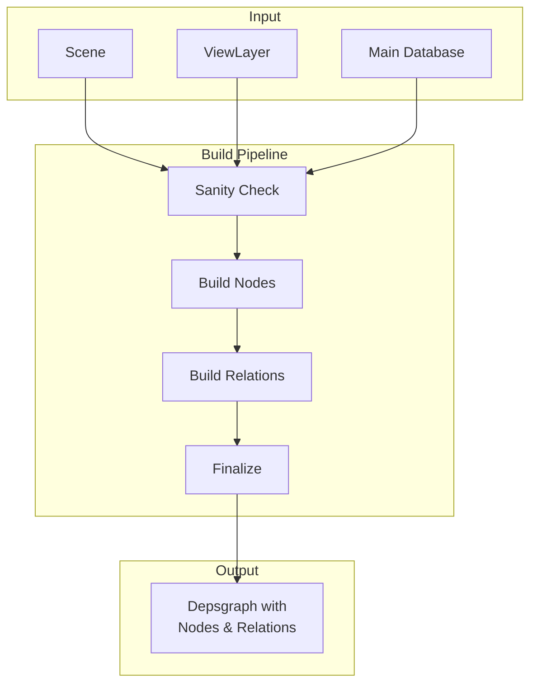

## Build Pipeline Architecture

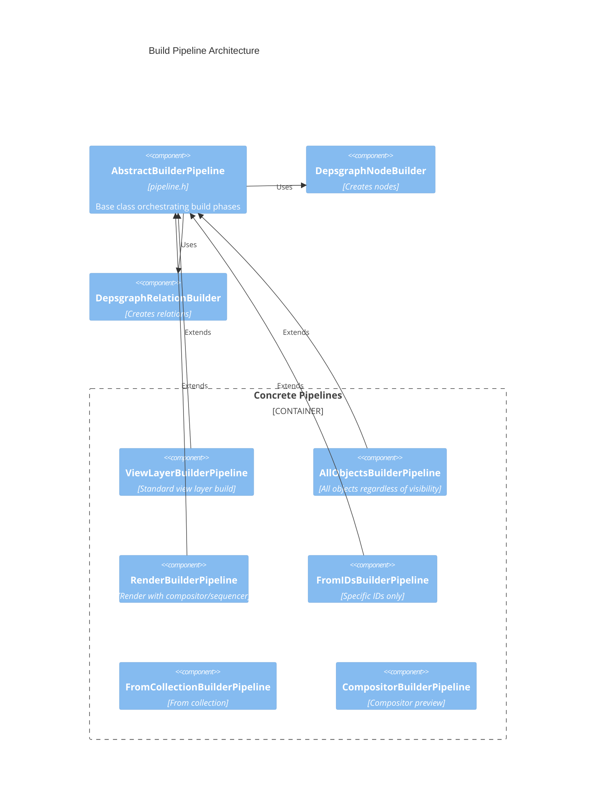

## Phase 1: Node Building

### Node Builder Flow

```mermaid
flowchart TB
    subgraph NodeBuilder["DepsgraphNodeBuilder"]
        BEGIN[begin_build]
        
        subgraph SceneLevel["Scene Level"]
            SCENE_PARAMS[build_scene_parameters]
            SCENE_COMP[build_scene_compositor]
            SCENE_CAM[build_scene_camera]
        end
        
        subgraph ViewLayerLevel["View Layer Level"]
            VIEW_LAYER[build_view_layer]
            LAYER_COLL[build_layer_collections]
        end
        
        subgraph ObjectLevel["Object Level"]
            OBJECT[build_object]
            OBJ_TRANS[build_object_transform]
            OBJ_DATA[build_object_data]
            OBJ_MODS[build_object_modifiers]
            OBJ_CONST[build_constraints]
        end
        
        subgraph DataLevel["Data Level"]
            ANIM[build_animdata]
            DRIVERS[build_drivers]
            SHADING[build_shading]
        end
        
        END_BUILD[end_build]
    end

    BEGIN --> SCENE_PARAMS --> SCENE_COMP --> SCENE_CAM
    SCENE_CAM --> VIEW_LAYER --> LAYER_COLL
    LAYER_COLL --> OBJECT
    OBJECT --> OBJ_TRANS --> OBJ_DATA --> OBJ_MODS --> OBJ_CONST
    OBJ_CONST --> ANIM --> DRIVERS --> SHADING
    SHADING --> END_BUILD
```

### Object Node Building Detail

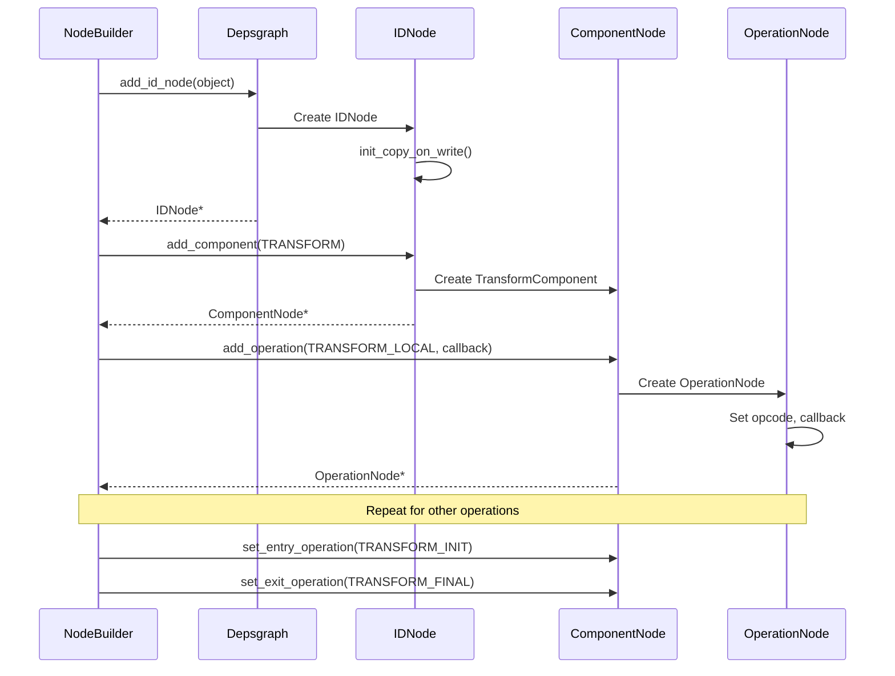

### Key Node Builder Methods

| Method | Purpose |
|--------|---------|
| `add_id_node(ID*)` | Create node for data-block |
| `add_component_node(ID*, NodeType)` | Add component to ID |
| `add_operation_node(...)` | Add operation with callback |
| `build_object(Object*)` | Build complete object graph |
| `build_object_transform(Object*)` | Transform component |
| `build_object_data(Object*)` | Geometry/data component |
| `build_object_modifiers(Object*)` | Modifier operations |
| `build_animdata(ID*)` | Animation component |
| `build_constraints(...)` | Constraint operations |

## Phase 2: Relation Building

### Relation Builder Flow

```mermaid
flowchart TB
    subgraph RelBuilder["DepsgraphRelationBuilder"]
        BEGIN[begin_build]
        
        subgraph SceneRels["Scene Relations"]
            SCENE_PARAMS[build_scene_parameters]
            SCENE_COMP[build_scene_compositor]
        end
        
        subgraph ObjectRels["Object Relations"]
            OBJECT[build_object]
            OBJ_PARENT[build_object_parent]
            OBJ_CONST[build_constraints]
            OBJ_MODS[build_object_modifiers]
            OBJ_DATA[build_object_data]
        end
        
        subgraph AnimRels["Animation Relations"]
            ANIM_DATA[build_animdata]
            ANIM_CURVES[build_animdata_curves]
            DRIVERS[build_driver]
        end
        
        subgraph SpecialRels["Special Relations"]
            PHYSICS[build_rigidbody]
            PARTICLES[build_particles]
        end
    end

    BEGIN --> SCENE_PARAMS --> SCENE_COMP
    SCENE_COMP --> OBJECT
    OBJECT --> OBJ_PARENT --> OBJ_CONST --> OBJ_MODS --> OBJ_DATA
    OBJ_DATA --> ANIM_DATA --> ANIM_CURVES --> DRIVERS
    DRIVERS --> PHYSICS --> PARTICLES
```

### Common Relations Created

```mermaid
flowchart TB
    subgraph ParentChild["Parent-Child Relation"]
        P_FINAL[Parent\nTRANSFORM_FINAL]
        C_PARENT[Child\nTRANSFORM_PARENT]
        P_FINAL -->|"Parent relation"| C_PARENT
    end

    subgraph Constraint["Constraint Target Relation"]
        T_FINAL[Target\nTRANSFORM_FINAL]
        CONST[Object\nTRANSFORM_CONSTRAINTS]
        T_FINAL -->|"Constraint target"| CONST
    end

    subgraph Modifier["Modifier Input Relation"]
        M_GEOM[Target\nGEOMETRY_EVAL]
        MOD_OP[Object\nMODIFIER]
        M_GEOM -->|"Modifier input"| MOD_OP
    end

    subgraph Driver["Driver Relation"]
        D_SRC[Source\nPARAMETERS]
        D_EVAL[DRIVER operation]
        D_TARG[Target property]
        D_SRC -->|"Driver input"| D_EVAL
        D_EVAL -->|"Driver output"| D_TARG
    end

    subgraph Animation["Animation Relation"]
        TIME[TimeSource]
        ANIM[ANIMATION_EVAL]
        PROP[Animated property]
        TIME -->|"Time"| ANIM
        ANIM -->|"Animation"| PROP
    end
```

### Key Relation Builder Methods

| Method | Creates Relation |
|--------|------------------|
| `add_relation(KeyFrom, KeyTo, desc)` | Generic relation |
| `build_object_parent(Object*)` | Parent → Child transform |
| `build_constraints(...)` | Target → Constraint |
| `build_object_modifiers(Object*)` | Input data → Modifier |
| `build_driver(ID*, FCurve*)` | Driver sources → Driver → Output |
| `build_animdata(ID*)` | Time → Animation → Properties |

### Relation Keys

The builder uses key types to identify nodes:

```cpp
// Component key
struct ComponentKey {
    ID *id;
    NodeType type;
    const char *name;
};

// Operation key  
struct OperationKey {
    ID *id;
    NodeType component_type;
    const char *component_name;
    OperationCode opcode;
    const char *name;
    int name_tag;
};

// Time source key
struct TimeSourceKey { };

// RNA path key (for drivers)
struct RNAPathKey {
    ID *id;
    const char *path;
};
```

## Phase 3: Finalization

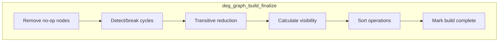

### Cycle Detection

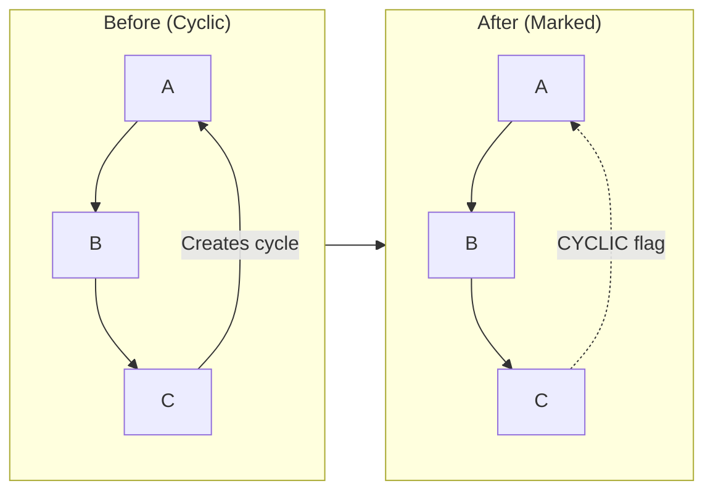

### Visibility Calculation

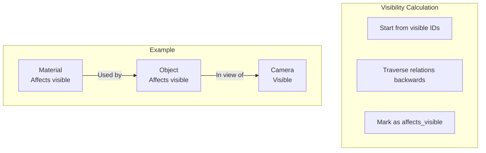

## Build Cache

The builder uses a cache for efficiency:

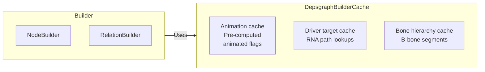

## Rebuild Triggers

The graph is rebuilt when:

| Trigger | Reason |
|---------|--------|
| New file load | Complete new scene |
| Undo/Redo | Scene structure changed |
| Add/Remove object | Graph structure changed |
| Add/Remove modifier | Dependencies changed |
| Reparenting | Hierarchy changed |
| `DEG_relations_tag_update()` | Explicit request |

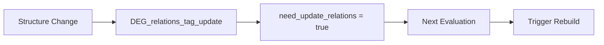

## Source Files

| File | Purpose |
|------|---------|
| `pipeline.h/cc` | AbstractBuilderPipeline base |
| `pipeline_view_layer.h/cc` | ViewLayer pipeline |
| `pipeline_render.h/cc` | Render pipeline |
| `pipeline_from_ids.h/cc` | From IDs pipeline |
| `deg_builder.h` | Base builder class |
| `deg_builder_nodes.h/cc` | Node creation |
| `deg_builder_relations.h/cc` | Relation creation |
| `deg_builder_key.h/cc` | Key types |
| `deg_builder_cache.h/cc` | Build caching |
| `deg_builder_cycle.h/cc` | Cycle detection |
| `deg_builder_transitive.h/cc` | Transitive reduction |
| `deg_builder_remove_noop.h/cc` | No-op removal |
