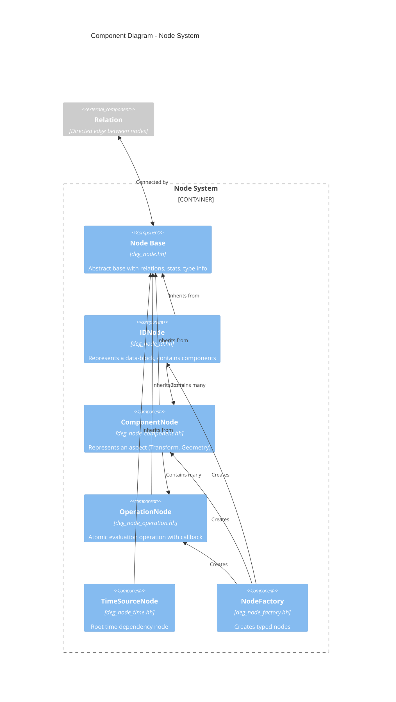
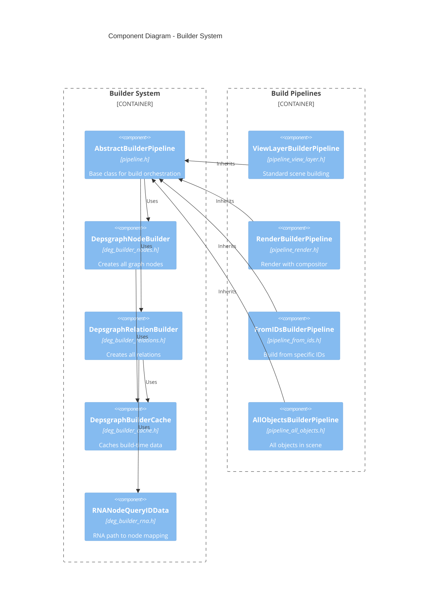
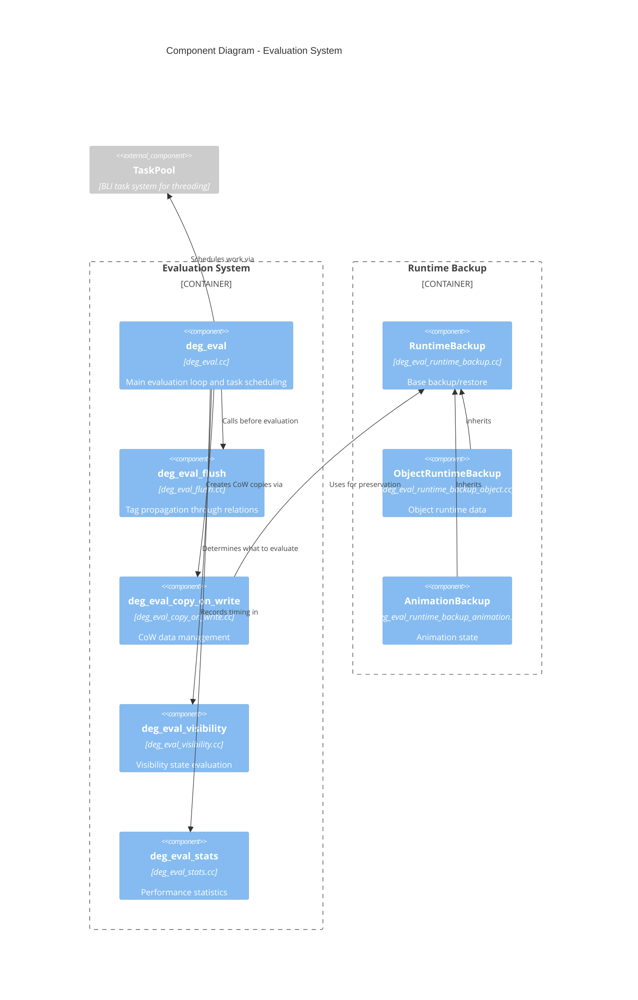

# C4 Component Diagram - Blender Dependency Graph

This diagram shows the detailed internal components and their interactions.

## Component Diagram - Node System



## Component Diagram - Builder System



## Component Diagram - Evaluation System



## Detailed Node Hierarchy

### Node Class Hierarchy

```text
Node (base)
├── TimeSourceNode
│     └── Provides time dependency root
│
├── IDNode
│     ├── id_orig: ID*       (original data-block)
│     ├── id_cow: ID*        (evaluated copy)
│     ├── components: Map<>   (component nodes)
│     └── eval_flags, customdata_masks
│
├── ComponentNode
│     ├── owner: IDNode*
│     ├── operations: Vector<OperationNode*>
│     ├── entry_operation, exit_operation
│     └── Component types:
│           ├── TransformComponentNode
│           ├── GeometryComponentNode
│           ├── AnimationComponentNode
│           ├── ParametersComponentNode
│           ├── PoseComponentNode
│           ├── BoneComponentNode
│           └── ... (20+ types)
│
└── OperationNode
      ├── owner: ComponentNode*
      ├── evaluate: DepsEvalOperationCb  (callback function)
      ├── opcode: OperationCode
      ├── flag: OperationFlag
      └── num_links_pending, scheduled
```

### Component Types

| Type | NodeType Enum | Purpose |
|------|---------------|---------|
| Transform | `TRANSFORM` | Object transforms, constraints |
| Geometry | `GEOMETRY` | Mesh, curves, modifiers |
| Animation | `ANIMATION` | NLA, Actions, F-Curves |
| Parameters | `PARAMETERS` | Custom properties, RNA |
| Pose | `EVAL_POSE` | Armature pose evaluation |
| Bone | `BONE` | Individual bone evaluation |
| Shading | `SHADING` | Material, texture updates |
| Visibility | `VISIBILITY` | Visibility state |
| Copy-on-Eval | `COPY_ON_EVAL` | CoW component |
| Synchronization | `SYNCHRONIZATION` | Sync back to original |

### Operation Codes (OperationCode enum)

**Transform Operations:**

- `TRANSFORM_INIT` - Initialize transform
- `TRANSFORM_LOCAL` - Local transforms
- `TRANSFORM_PARENT` - Parent relationship
- `TRANSFORM_CONSTRAINTS` - Constraint evaluation
- `TRANSFORM_FINAL` - Final world matrix

**Geometry Operations:**

- `GEOMETRY_EVAL_INIT` - Initialize geometry eval
- `MODIFIER` - Modifier stack evaluation
- `GEOMETRY_EVAL` - Full geometry evaluation
- `GEOMETRY_EVAL_DONE` - Finalize geometry

**Pose/Bone Operations:**

- `POSE_INIT` - Initialize pose
- `BONE_LOCAL` - Bone local transform
- `BONE_POSE_PARENT` - Bone parent/rest pose
- `BONE_CONSTRAINTS` - Bone constraints
- `BONE_DONE` - Finalize bone
- `POSE_IK_SOLVER` - IK solver

**Animation Operations:**

- `ANIMATION_ENTRY` - Start animation eval
- `ANIMATION_EVAL` - Evaluate animation
- `DRIVER` - Driver evaluation

## Relation Types

```cpp
enum RelationFlag {
    RELATION_FLAG_CYCLIC        // Part of a cycle
    RELATION_FLAG_NO_FLUSH      // Don't propagate updates
    RELATION_FLAG_FLUSH_USER_EDIT_ONLY  // Only on user edit
    RELATION_FLAG_GODMODE       // Can't be broken by cycle solver
    RELATION_CHECK_BEFORE_ADD   // Check existence first
    RELATION_NO_VISIBILITY_CHANGE  // Doesn't affect visibility
};
```

### Relation Structure

```cpp
struct Relation {
    Node *from;           // Source node (A)
    Node *to;             // Target node (B)
    const char *name;     // Debug label
    int flag;             // RelationFlag bitmask
};
// Meaning: B depends on A (A must evaluate before B)
```

## Builder Process Detail

### Phase 1: Node Building

```text
DepsgraphNodeBuilder::build_view_layer()
├── build_scene_parameters()
├── build_scene_compositor()
├── For each LayerCollection:
│   └── build_collection()
│       └── For each Object:
│           └── build_object()
│               ├── add_id_node(object)
│               ├── build_object_transform()
│               ├── build_object_data()
│               ├── build_object_modifiers()
│               ├── build_animdata()
│               └── build_constraints()
└── build_layer_collections()
```

### Phase 2: Relation Building

```text
DepsgraphRelationBuilder::build_view_layer()
├── build_scene_parameters()
├── For each Object:
│   └── build_object()
│       ├── build_object_parent()
│       │   └── add_relation(parent.TRANSFORM_FINAL → child.TRANSFORM_PARENT)
│       ├── build_constraints()
│       │   └── add_relation(target → constraint_component)
│       ├── build_object_modifiers()
│       │   └── add_relation(modifier_data → GEOMETRY)
│       └── build_animdata()
│           └── add_relation(ANIMATION → animated_property)
└── build_driver_relations()
```

## Evaluation Process Detail

```text
deg_evaluate_on_refresh(graph)
├── deg_graph_flush_updates(graph)     // Propagate tags
│   ├── flush_schedule_entrypoints()   // Get tagged nodes
│   └── For each tagged node:
│       └── flush to dependents via relations
│
├── Evaluation stages:
│   ├── COPY_ON_EVAL stage
│   │   └── Ensure all CoW data exists
│   │
│   ├── DYNAMIC_VISIBILITY stage
│   │   └── Evaluate visibility-affecting operations
│   │
│   └── THREADED_EVALUATION stage
│       ├── calculate_pending_parents()
│       ├── schedule_root_nodes()       // Nodes with 0 pending
│       └── TaskPool parallel execution:
│           └── For each ready node:
│               ├── evaluate_node()
│               └── schedule_children()
│
└── deg_graph_clear_tags(graph)        // Clean up
```

## Source File Reference

| Component | File | Purpose |
|-----------|------|---------|
| Node base | `intern/node/deg_node.hh` | Base node class |
| ID Node | `intern/node/deg_node_id.hh` | Per-datablock node |
| Component Node | `intern/node/deg_node_component.hh` | Component types |
| Operation Node | `intern/node/deg_node_operation.hh` | Atomic operations |
| Relation | `intern/depsgraph_relation.hh` | Edge/dependency |
| Node Builder | `intern/builder/deg_builder_nodes.h` | Node creation |
| Relation Builder | `intern/builder/deg_builder_relations.h` | Relation creation |
| Pipeline | `intern/builder/pipeline.h` | Build orchestration |
| Evaluation | `intern/eval/deg_eval.cc` | Evaluation engine |
| Flush | `intern/eval/deg_eval_flush.cc` | Tag propagation |
| CoW | `intern/eval/deg_eval_copy_on_write.cc` | Copy-on-eval |
