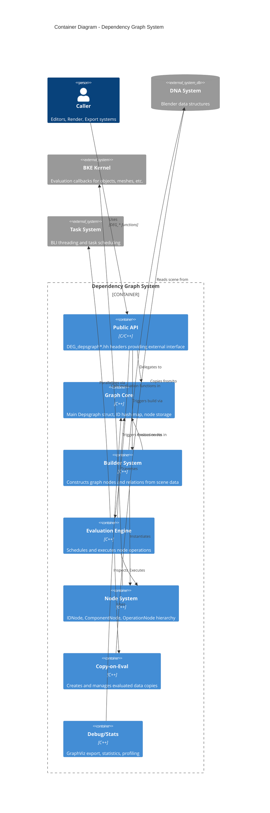

# C4 Container Diagram - Blender Dependency Graph

This diagram shows the major containers (components/modules) within the dependency graph system.

## Container Diagram



## Container Descriptions

### Public API (`DEG_depsgraph*.hh`)

The external interface for all depsgraph operations:

| Header | Purpose |
|--------|---------|
| `DEG_depsgraph.hh` | Core API: create, free, tag, evaluate |
| `DEG_depsgraph_build.hh` | Graph building and relation creation |
| `DEG_depsgraph_query.hh` | Querying evaluated data and state |
| `DEG_depsgraph_debug.hh` | Debug output and statistics |
| `DEG_depsgraph_physics.hh` | Physics simulation integration |

### Graph Core (`intern/depsgraph.hh`)

The central `Depsgraph` struct containing:

```cpp
struct Depsgraph {
    // Node storage
    Map<const ID *, IDNode *> id_hash;     // Quick ID lookup
    Vector<IDNode *> id_nodes;              // Ordered ID nodes
    Vector<OperationNode *> operations;     // All operations for traversal
    
    // Graph metadata
    Main *bmain;
    Scene *scene;
    ViewLayer *view_layer;
    eEvaluationMode mode;
    
    // Evaluation state
    float frame, ctime;
    Set<OperationNode *> entry_tags;
    bool is_evaluating;
};
```

### Builder System (`intern/builder/`)

Two-phase graph construction:

| Builder | Purpose |
|---------|---------|
| `DepsgraphNodeBuilder` | Creates IDNodes, ComponentNodes, OperationNodes |
| `DepsgraphRelationBuilder` | Creates Relations between nodes |

Build pipelines for different use cases:

| Pipeline | Use Case |
|----------|----------|
| `ViewLayerBuilderPipeline` | Normal viewport/scene building |
| `AllObjectsBuilderPipeline` | All objects regardless of visibility |
| `RenderBuilderPipeline` | Render with compositor/sequencer |
| `FromIDsBuilderPipeline` | Specific IDs only |

### Evaluation Engine (`intern/eval/`)

| Module | Function |
|--------|----------|
| `deg_eval.cc` | Main evaluation loop, task scheduling |
| `deg_eval_flush.cc` | Tag propagation through relations |
| `deg_eval_copy_on_write.cc` | CoW data creation |
| `deg_eval_visibility.cc` | Visibility evaluation |
| `deg_eval_runtime_backup_*.cc` | Runtime data preservation |

### Node System (`intern/node/`)

Three-level hierarchy:

```text
                    ┌──────────────────┐
                    │     IDNode       │ Per data-block
                    │  (Object, Mesh)  │
                    └────────┬─────────┘
                             │ contains
              ┌──────────────┼──────────────┐
              ▼              ▼              ▼
        ┌──────────┐   ┌──────────┐   ┌──────────┐
        │Component │   │Component │   │Component │
        │Transform │   │ Geometry │   │Animation │
        └────┬─────┘   └────┬─────┘   └────┬─────┘
             │ contains      │              │
      ┌──────┴──────┐   ┌───┴────┐    ┌────┴────┐
      ▼             ▼   ▼        ▼    ▼         ▼
┌──────────┐ ┌──────────┐ ┌──────────┐ ┌──────────┐
│Operation │ │Operation │ │Operation │ │Operation │
│  INIT    │ │ PARENT   │ │ MODIFIER │ │  DRIVER  │
└──────────┘ └──────────┘ └──────────┘ └──────────┘
```

### Copy-on-Eval System

Separates original and evaluated data:

```text
Original Data (in Main)              Evaluated Data (in Depsgraph)
┌─────────────────────┐             ┌─────────────────────┐
│ Object "Cube"       │             │ Object "Cube" (CoW) │
│ - location: (0,0,0) │  ──copy──▶  │ - location: (0,0,0) │
│ - modifiers: [...]  │             │ - evaluated_mesh    │
└─────────────────────┘             └─────────────────────┘
        ↑                                    │
   User edits                         Used for display
```

## Data Flow

```text
┌─────────────────────────────────────────────────────────────┐
│                      Build Phase                             │
│                                                              │
│  Scene Data ──▶ NodeBuilder ──▶ RelationBuilder ──▶ Graph   │
└─────────────────────────────────────────────────────────────┘
                              │
                              ▼
┌─────────────────────────────────────────────────────────────┐
│                    Evaluation Phase                          │
│                                                              │
│  Tags ──▶ Flush ──▶ Schedule ──▶ Execute ──▶ Evaluated Data │
└─────────────────────────────────────────────────────────────┘
```

## Threading Model

The evaluation engine uses Blender's task system:

```text
┌─────────────────────────────────────────────────────────┐
│                     Task Pool                            │
│  ┌─────────┐ ┌─────────┐ ┌─────────┐ ┌─────────┐       │
│  │ Thread  │ │ Thread  │ │ Thread  │ │ Thread  │       │
│  │   1     │ │   2     │ │   3     │ │   N     │       │
│  └────┬────┘ └────┬────┘ └────┬────┘ └────┬────┘       │
│       │           │           │           │             │
│       ▼           ▼           ▼           ▼             │
│  ┌─────────────────────────────────────────────────┐   │
│  │            Operation Node Queue                  │   │
│  │  [Op1] [Op2] [Op3] [Op4] [Op5] [Op6] ...        │   │
│  └─────────────────────────────────────────────────┘   │
└─────────────────────────────────────────────────────────┘
```

Evaluation respects:

- **Dependencies**: Node only executes when all inputs are ready
- **Visibility**: Invisible nodes may be skipped
- **Thread Safety**: CoW ensures safe parallel access

## Source File Mapping

| Container | Primary Files |
|-----------|---------------|
| Public API | `DEG_depsgraph*.hh` |
| Graph Core | `intern/depsgraph.cc`, `intern/depsgraph.hh` |
| Builder | `intern/builder/deg_builder_*.cc/h` |
| Evaluator | `intern/eval/deg_eval*.cc/h` |
| Nodes | `intern/node/deg_node*.cc/hh` |
| Debug | `intern/debug/deg_debug*.cc` |
