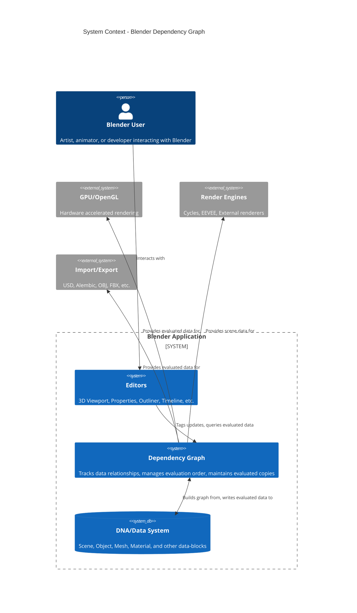

# C4 Context Diagram - Blender Dependency Graph

This diagram shows how the Dependency Graph (depsgraph) fits within the broader Blender ecosystem at the system context level.

## System Context Diagram



## Context Description

### External Actors

| Actor | Description |
|-------|-------------|
| **Blender User** | The artist, animator, or developer who interacts with Blender through its various editors |
| **GPU/OpenGL** | The graphics hardware that renders the viewport using evaluated scene data |
| **Render Engines** | Cycles, EEVEE, or external engines that render final images |
| **Import/Export** | File format handlers that need evaluated scene data |

### Blender Systems

| System | Purpose |
|--------|---------|
| **Editors** | User interface components (3D View, Properties Panel, Outliner, etc.) |
| **Dependency Graph** | Core system that manages data relationships and evaluation |
| **DNA/Data System** | The raw Blender data structures stored in .blend files |

## Key Interactions

### 1. User → Editors → Depsgraph

When a user makes changes:

```text
User Action → Editor → DEG_id_tag_update() → Depsgraph
```

Example: Moving an object triggers:
1. User drags object in 3D viewport
2. Editor calls `DEG_id_tag_update(object, ID_RECALC_TRANSFORM)`
3. Depsgraph tags the object and all dependents for update

### 2. Depsgraph → Data System

The depsgraph maintains two types of data:

- **Original Data**: Stored in Main database, edited by users
- **Evaluated Data (CoW)**: Copies created by depsgraph for evaluation

```text
Original Data → Copy-on-Eval → Evaluated Data
     ↑                              ↓
  User edits                 Viewport/Render uses
```

### 3. Depsgraph → GPU/Render

The depsgraph provides:

- Evaluated object transforms
- Evaluated mesh geometry
- Material and shader data
- Visibility information

## Evaluation Modes

The depsgraph supports two primary evaluation modes:

| Mode | Use Case | Created By |
|------|----------|------------|
| `DAG_EVAL_VIEWPORT` | 3D viewport display | Window Manager |
| `DAG_EVAL_RENDER` | Final renders, exports | Render pipeline, exporters |

Each View Layer can have its own depsgraph with potentially different evaluation modes.

## Multiple Depsgraphs

Blender can have multiple depsgraphs simultaneously:

```text
┌─────────────────────────────────────────────────┐
│                    Scene                         │
├─────────────────────────────────────────────────┤
│  ViewLayer "View Layer"                          │
│    ├── Viewport Depsgraph (DAG_EVAL_VIEWPORT)   │
│    └── Render Depsgraph (DAG_EVAL_RENDER)       │
├─────────────────────────────────────────────────┤
│  ViewLayer "RenderLayer"                         │
│    └── Render Depsgraph (DAG_EVAL_RENDER)       │
└─────────────────────────────────────────────────┘
```

## Related Source Files

| File | Purpose |
|------|---------|
| `DEG_depsgraph.hh` | Main public API |
| `intern/depsgraph.hh` | Core Depsgraph struct definition |
| `intern/depsgraph_registry.cc` | Multiple depsgraph management |
