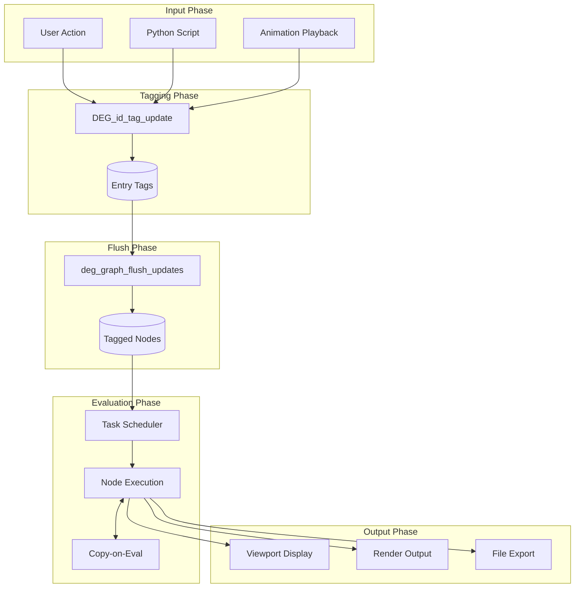
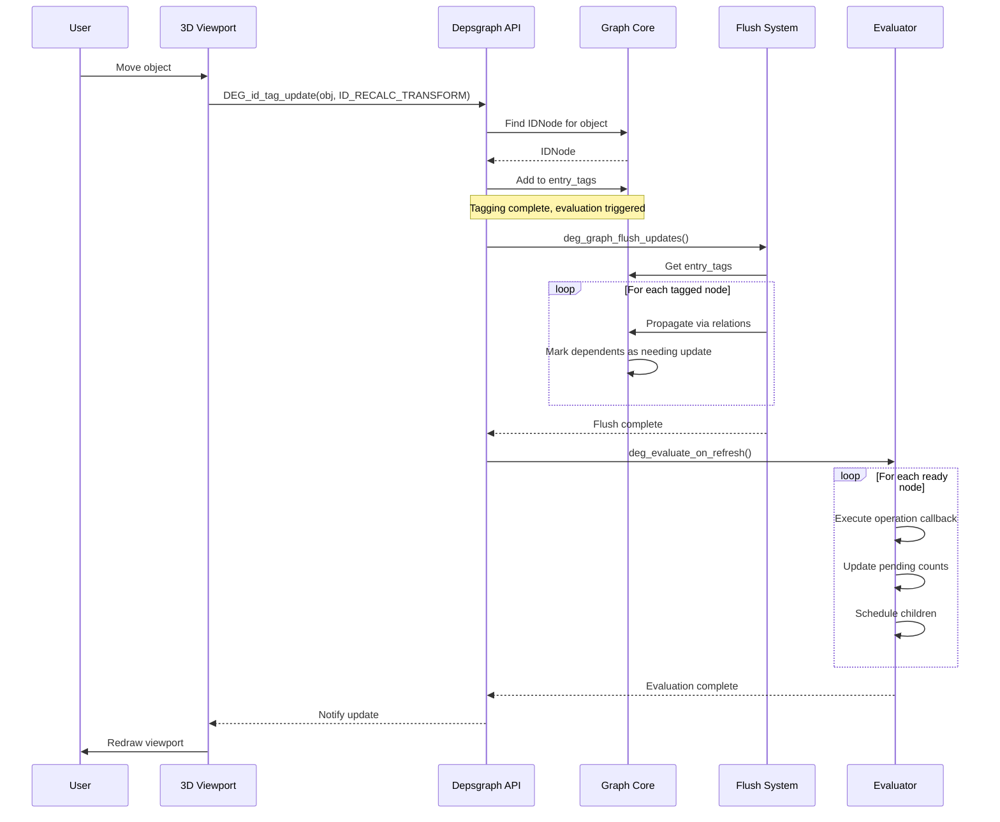
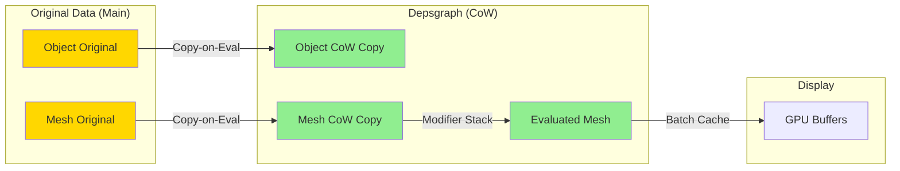
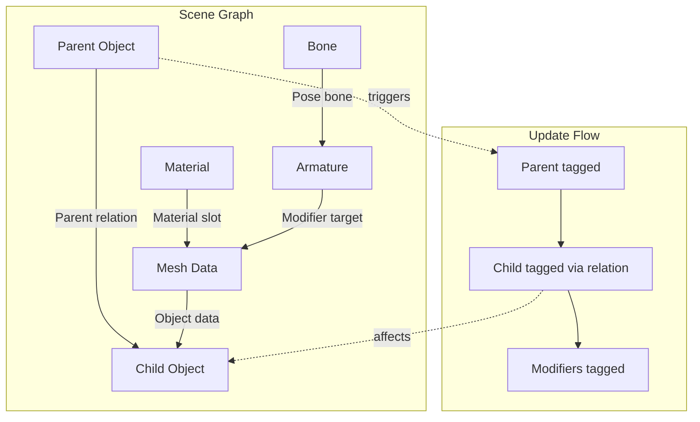
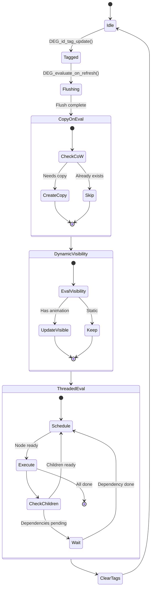
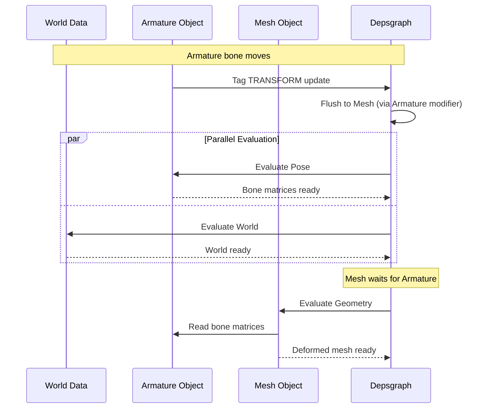
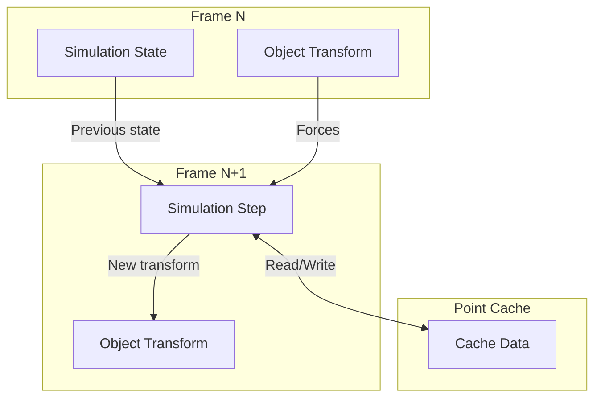

# Data Flow Diagram - Blender Dependency Graph

This document explains how data flows through the dependency graph system.

## High-Level Data Flow



## Detailed Flow: Object Transform Update

This sequence shows what happens when a user moves an object:



## Copy-on-Eval Data Flow



## Tag Propagation Flow

Shows how update tags flow through the graph:



## Evaluation Stage Flow



## Relation Types and Data Flow

```mermaid
flowchart TB
    subgraph DataFlow["Data Dependency"]
        A1[Mesh Data] -->|"Geometry"| A2[Object Geometry]
        A2 -->|"Input"| A3[Modifier]
    end

    subgraph TimeFlow["Time Dependency"]
        B1[Time Source] -->|"Frame"| B2[Animation]
        B2 -->|"Value"| B3[Transform]
    end

    subgraph VisFlow["Visibility Dependency"]
        C1[Collection] -->|"Contains"| C2[Object]
        C2 -->|"Instances"| C3[Instance]
    end

    subgraph DriverFlow["Driver Dependency"]
        D1[Driver Target] -->|"Drives"| D2[Driver]
        D2 -->|"Output"| D3[Animated Property]
    end
```



## Multi-Object Update Example



## Physics Simulation Flow



## Data Flow Summary

| Phase | Input | Processing | Output |
|-------|-------|------------|--------|
| **Tagging** | User edit, script, animation | `DEG_id_tag_update()` | Entry tags in graph |
| **Flushing** | Entry tags | Relation traversal | All affected nodes tagged |
| **CoW** | Original data | Deep copy | Evaluated data copies |
| **Evaluation** | Tagged nodes | Topological order execution | Updated evaluated data |
| **Output** | Evaluated data | Batch cache, draw calls | Viewport/render |

## Key Data Structures

### Entry Tags

```cpp
// In Depsgraph struct
Set<OperationNode *> entry_tags;  // Initially modified nodes
```

### Node Update Flags

```cpp
enum OperationFlag {
    DEPSOP_FLAG_NEEDS_UPDATE      = (1 << 0),
    DEPSOP_FLAG_DIRECTLY_MODIFIED = (1 << 1),
    DEPSOP_FLAG_USER_MODIFIED     = (1 << 2),
};
```

### Recalc Flags

```cpp
// In DNA_ID.h
typedef enum IDRecalcFlag {
    ID_RECALC_TRANSFORM   = (1 << 0),
    ID_RECALC_GEOMETRY    = (1 << 1),
    ID_RECALC_ANIMATION   = (1 << 2),
    ID_RECALC_SHADING     = (1 << 8),
    // ... more flags
} IDRecalcFlag;
```
