# Evaluation Process - Blender Dependency Graph

This document explains how the dependency graph evaluates nodes to produce updated scene data.

## Evaluation Overview

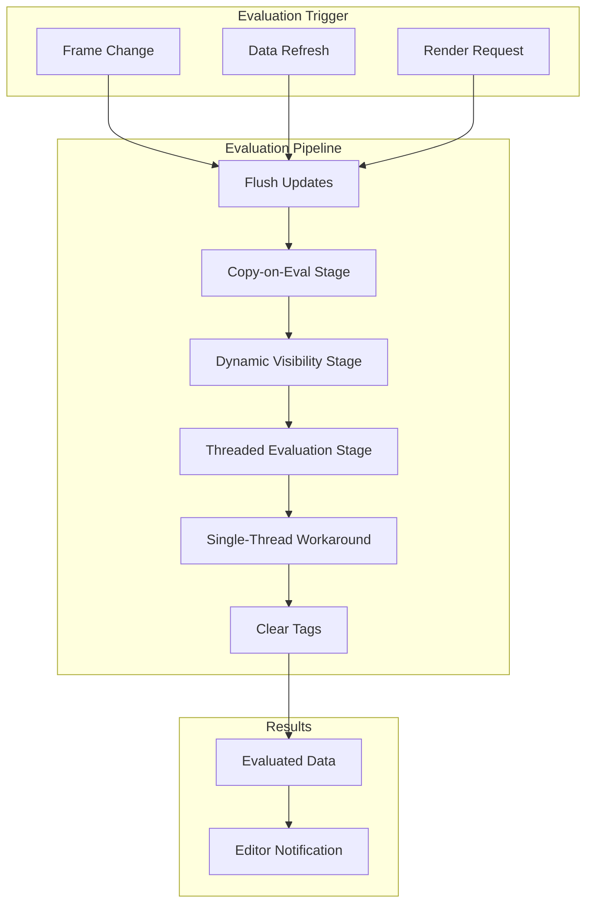

## Evaluation Entry Points

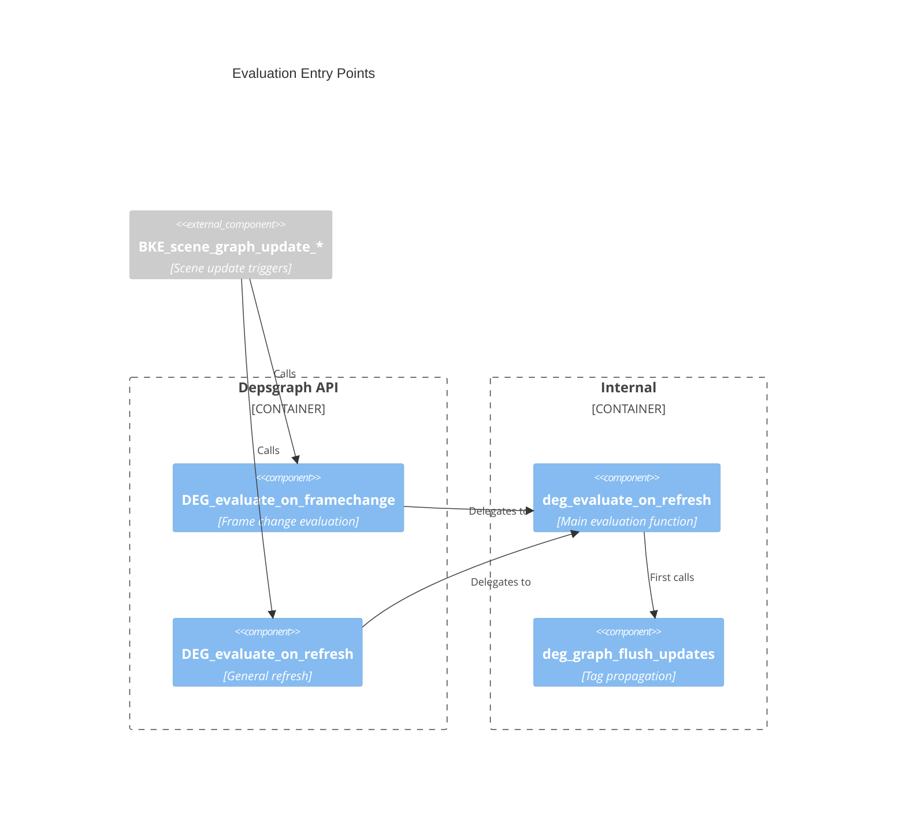

## Stage 1: Flush Updates

The flush phase propagates update tags through the graph:

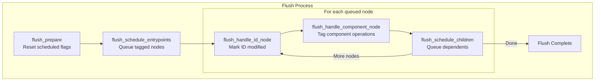

### Tag Propagation Rules

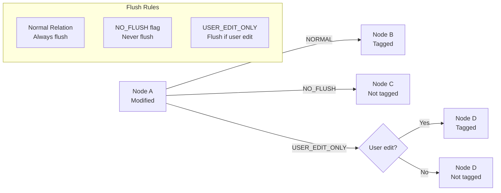

## Stage 2: Copy-on-Eval

Ensures all needed data has evaluated copies:

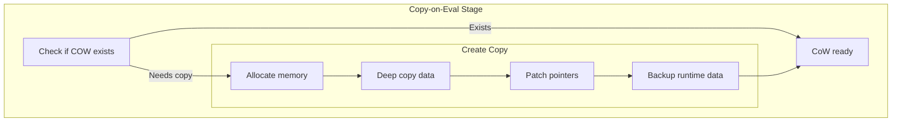

### CoW Data Lifecycle

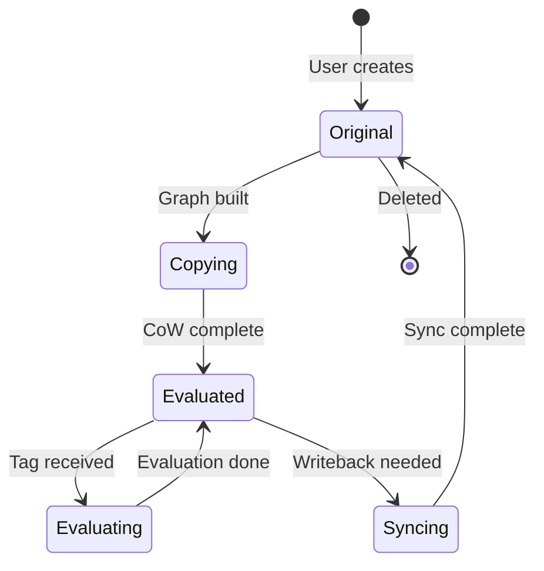

## Stage 3: Dynamic Visibility

Evaluates visibility-affecting operations:

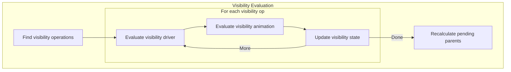

## Stage 4: Threaded Evaluation

Main parallel evaluation of operations:

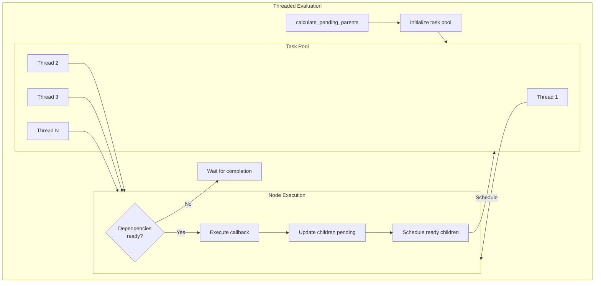

### Pending Count Management

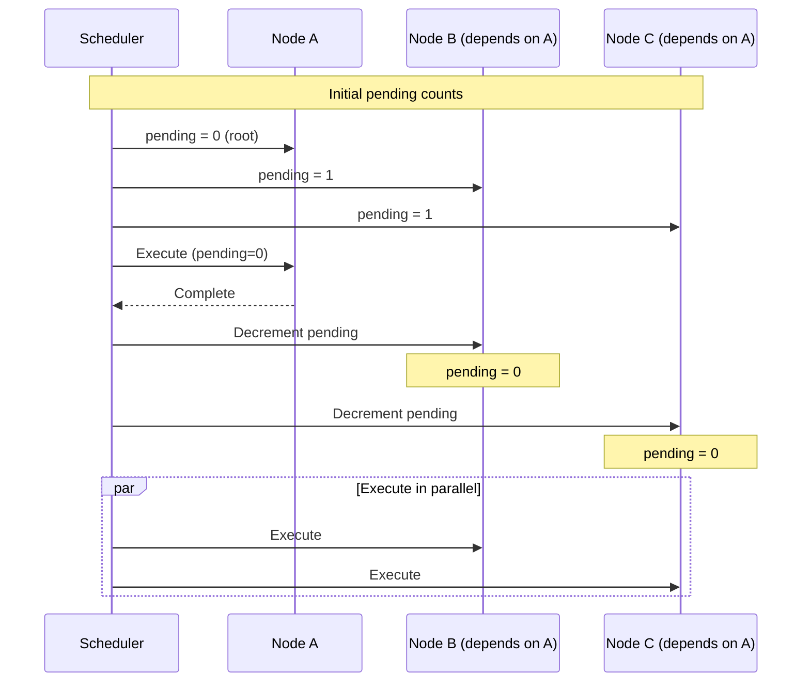

### Visibility Optimization

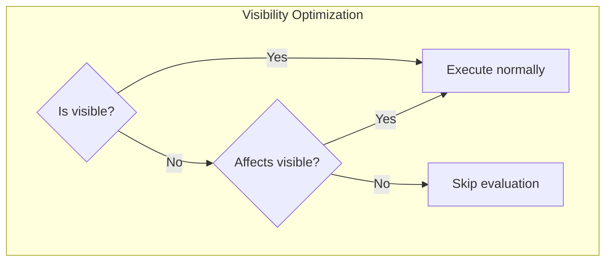

## Stage 5: Single-Thread Workaround

Some operations must run single-threaded:

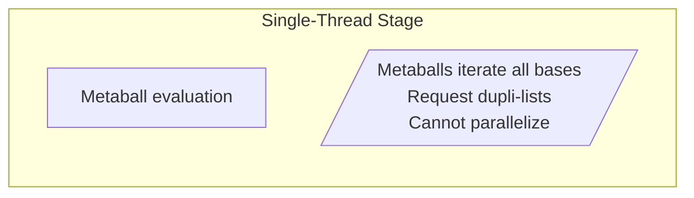

## Evaluation Callbacks

Operation nodes contain callbacks to BKE functions:

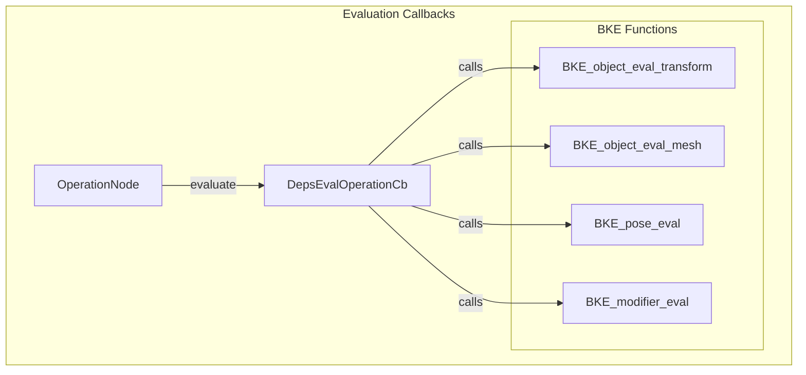

### Example: Transform Evaluation

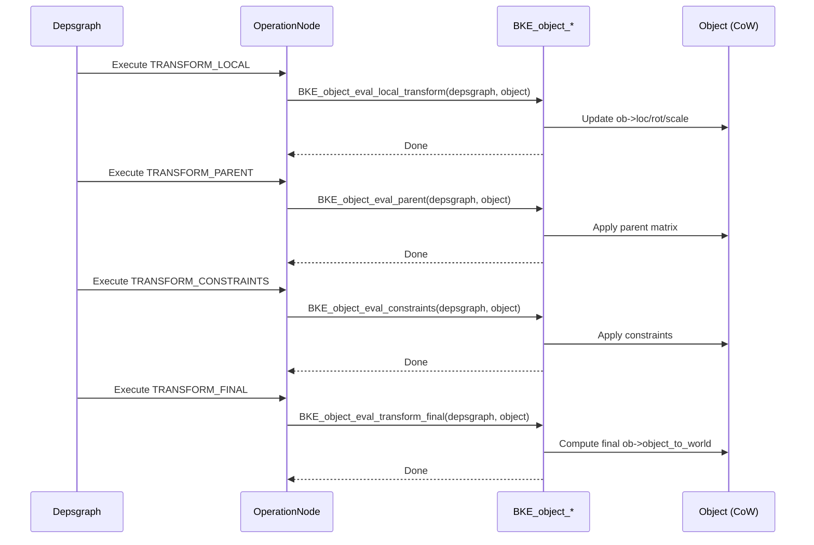

## Runtime Backup System

Preserves runtime data across CoW updates:

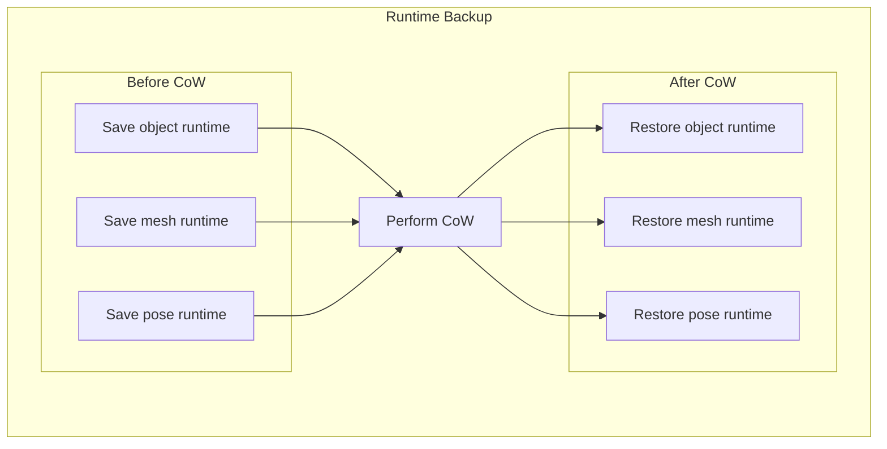

### Backed Up Data Types

| Backup Class | Data Preserved |
|--------------|----------------|
| `ObjectRuntimeBackup` | Base flags, batch cache, curve cache |
| `AnimationBackup` | NLA state, action blending |
| `PoseRuntimeBackup` | Pose state, IK state |
| `ModifierRuntimeBackup` | Modifier cache |
| `MeshRuntimeBackup` | Evaluated mesh, batch cache |

## Performance Statistics

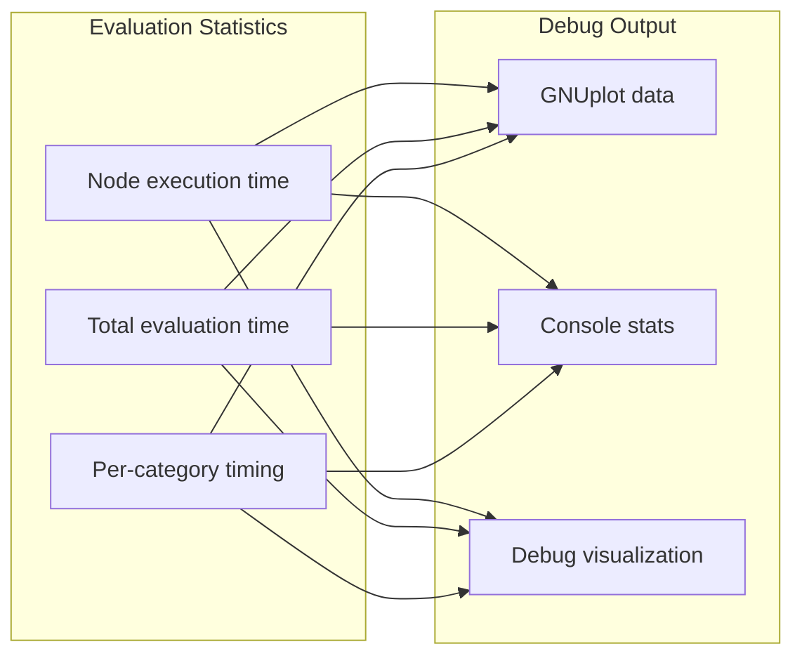

## Writeback System

Some evaluated data can sync back to original:

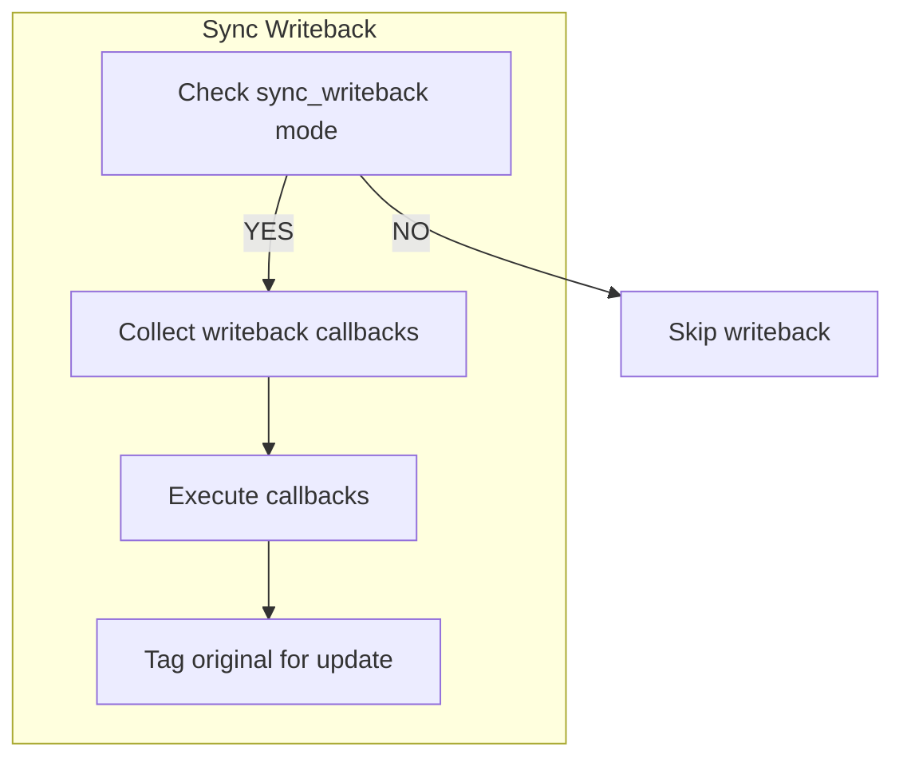

### Writeback Use Cases

| Use Case | Data |
|----------|------|
| FCurve baking | Animation data |
| Simulation baking | Physics cache |
| Shape key from deform | Mesh data |

## Source Files

| File | Purpose |
|------|---------|
| `deg_eval.cc` | Main evaluation loop |
| `deg_eval.h` | Evaluation interface |
| `deg_eval_flush.cc` | Tag propagation |
| `deg_eval_copy_on_write.cc` | CoW management |
| `deg_eval_visibility.cc` | Visibility evaluation |
| `deg_eval_stats.cc` | Performance stats |
| `deg_eval_runtime_backup*.cc` | Runtime preservation |

## Key Functions

| Function | Purpose |
|----------|---------|
| `deg_evaluate_on_refresh()` | Main entry point |
| `deg_graph_flush_updates()` | Propagate tags |
| `deg_update_copy_on_write_datablock()` | Create/update CoW |
| `deg_graph_flush_visibility()` | Visibility updates |
| `evaluate_node()` | Execute single node |
| `schedule_children()` | Schedule ready dependents |
