# Node Hierarchy - Blender Dependency Graph

This document provides detailed documentation of the node type system.

## Node Class Hierarchy Diagram

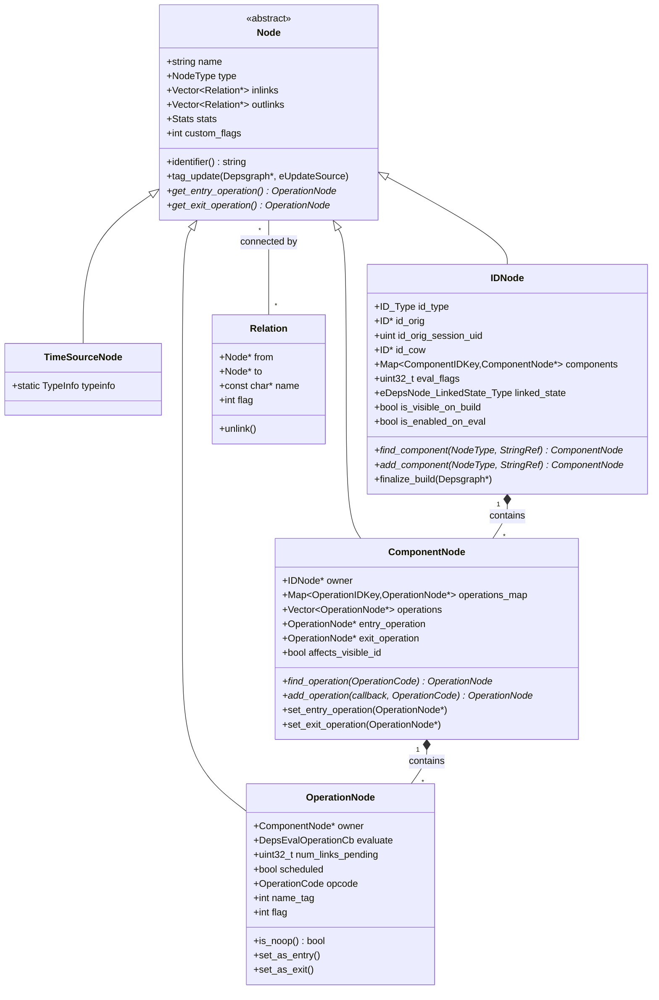

## NodeType Enumeration

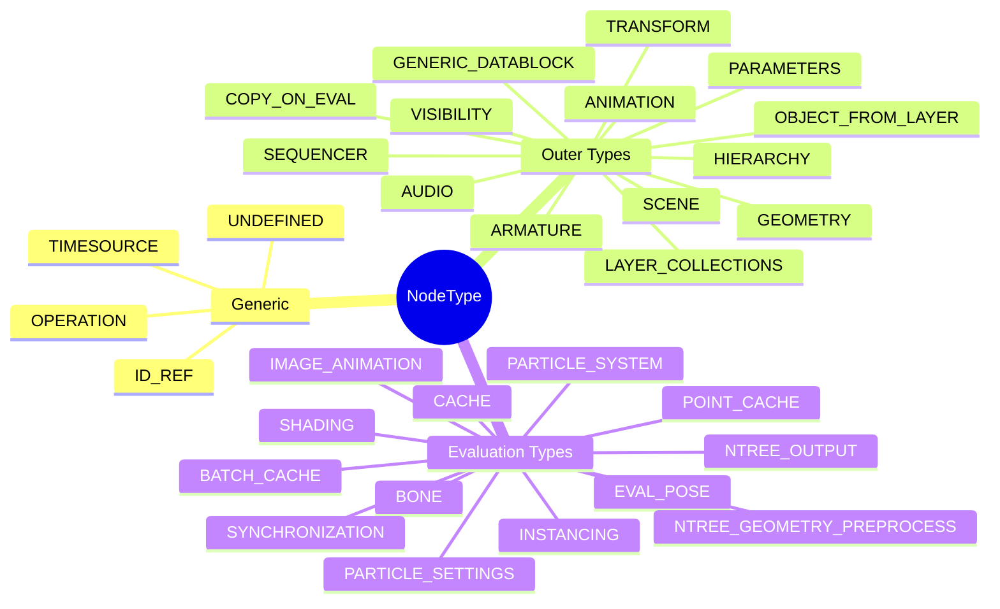

## Component Node Types

### Transform Component

Handles object spatial transformations:

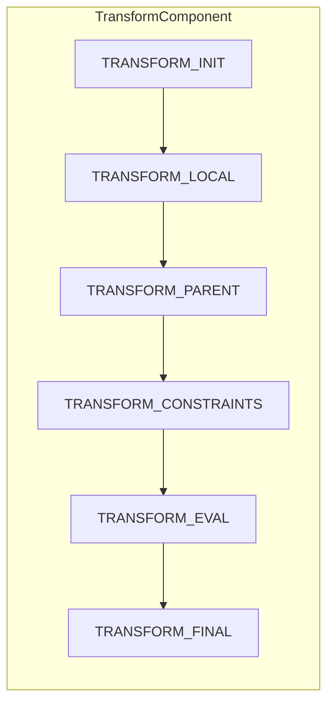

**Operations:**

| OperationCode | Purpose |
|---------------|---------|
| `TRANSFORM_INIT` | Initialize transform evaluation |
| `TRANSFORM_LOCAL` | Apply local transform |
| `TRANSFORM_PARENT` | Apply parent transform |
| `TRANSFORM_CONSTRAINTS` | Evaluate transform constraints |
| `TRANSFORM_SIMULATION_INIT` | Initialize for simulation |
| `TRANSFORM_EVAL` | Handle special cases |
| `TRANSFORM_FINAL` | Finalize world matrix |

### Geometry Component

Handles mesh/curve/volume geometry:

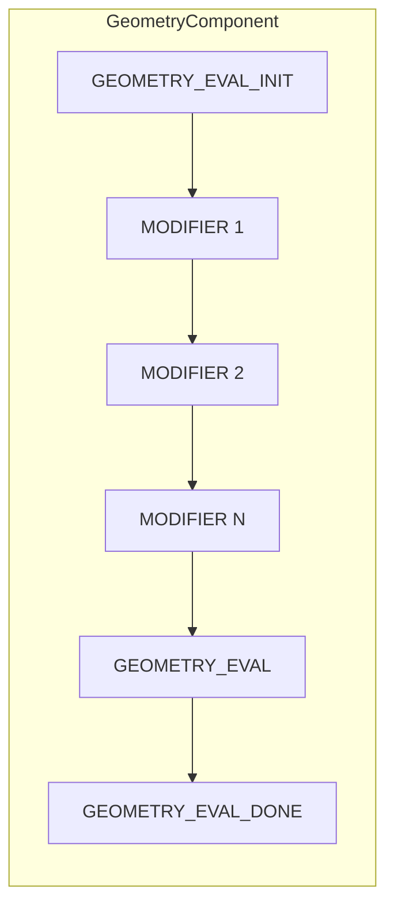

**Operations:**

| OperationCode | Purpose |
|---------------|---------|
| `GEOMETRY_EVAL_INIT` | Entry point, prepare geometry |
| `MODIFIER` | Individual modifier evaluation |
| `GEOMETRY_EVAL` | Full geometry evaluation |
| `GEOMETRY_EVAL_DONE` | Finalize, cleanup |
| `GEOMETRY_SHAPEKEY` | Shape key evaluation |

### Animation Component

Handles F-Curves, NLA, Actions:

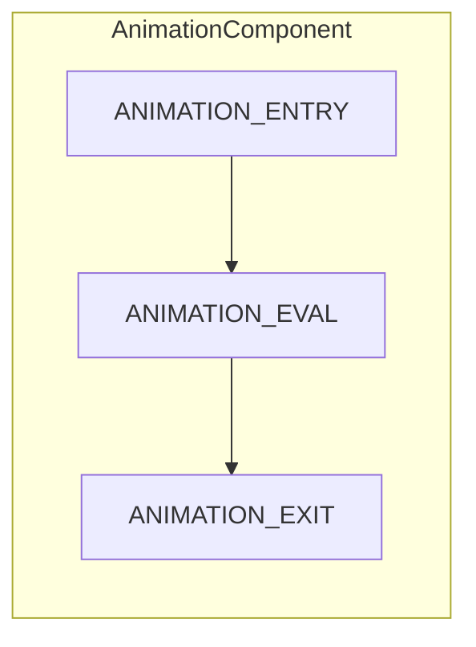

**Operations:**

| OperationCode | Purpose |
|---------------|---------|
| `ANIMATION_ENTRY` | Begin animation evaluation |
| `ANIMATION_EVAL` | Evaluate NLA/Action data |
| `ANIMATION_EXIT` | Finalize animation |
| `DRIVER` | Evaluate individual drivers |

### Pose Component (Armature)

Handles armature pose evaluation:

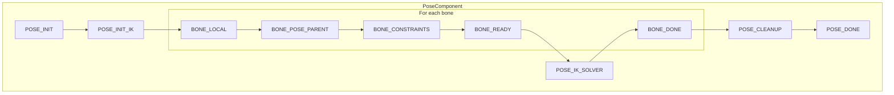

### Copy-on-Eval Component

Manages evaluated data copies:

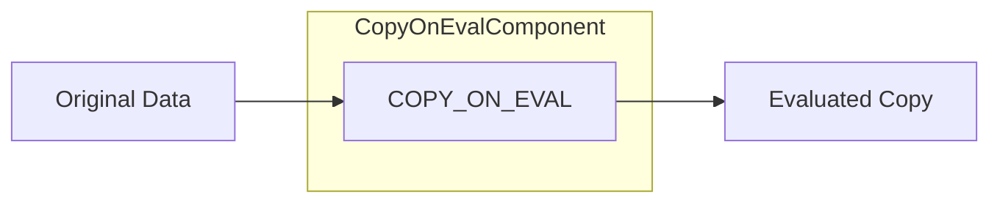

### Visibility Component

Manages visibility state:

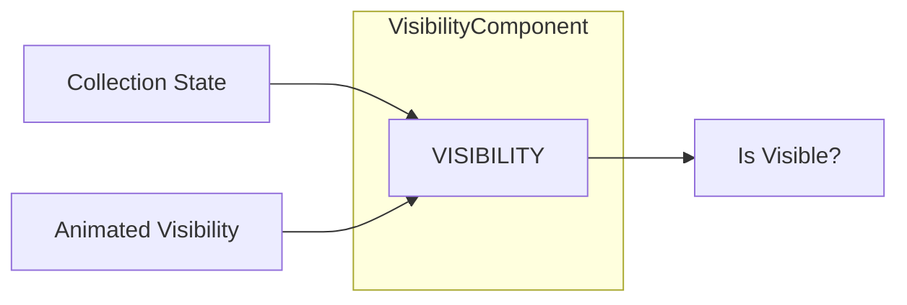

## ID Node Structure

Each data-block gets an IDNode:

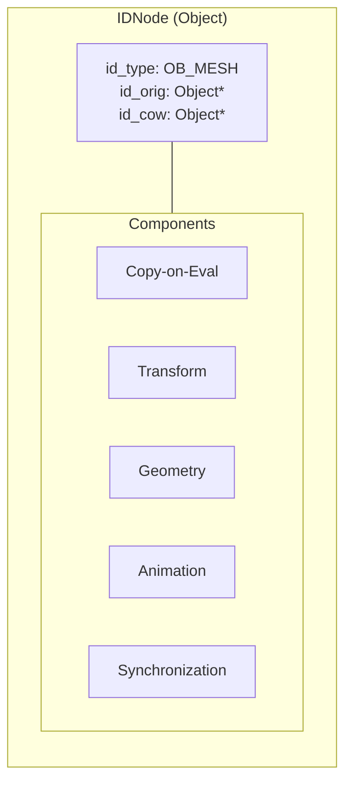

## Relation System

### Relation Flags

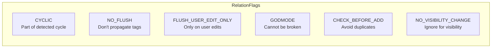

### Common Relation Patterns

**Parent-Child:**

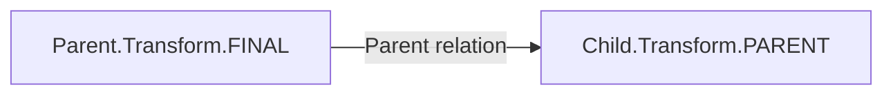

**Modifier Dependency:**

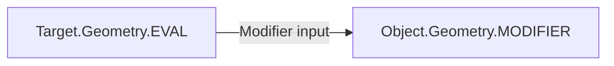

**Driver:**

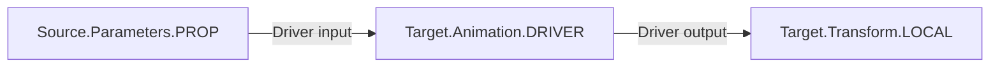

**Constraint:**

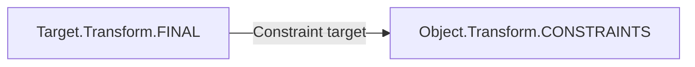

## Node Factory System

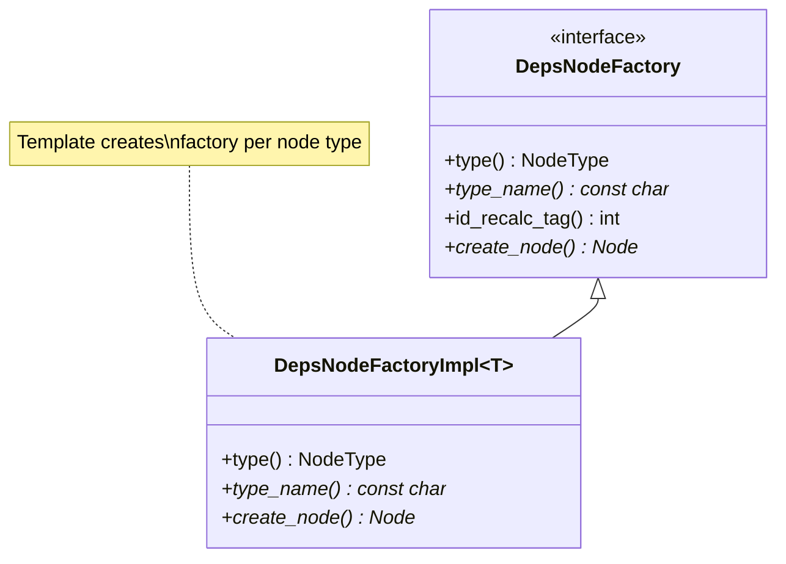

## Node Statistics

Each node tracks evaluation statistics:

```cpp
struct Node::Stats {
    double current_time;  // Time for current evaluation
    
    void reset();
    void reset_current();
};
```

Used for:

- Performance profiling
- Identifying bottlenecks
- Debug visualization

## Custom Flags Usage

The `custom_flags` field is repurposed in different phases:

| Phase | IDNode Usage | ComponentNode Usage |
|-------|--------------|---------------------|
| **Build** | Build state | Build state |
| **Flush** | `ID_STATE_MODIFIED` | `COMPONENT_STATE_*` |
| **Eval** | Visibility state | Visibility state |

## Source Files

| Type | Header | Implementation |
|------|--------|----------------|
| Node base | `deg_node.hh` | `deg_node.cc` |
| IDNode | `deg_node_id.hh` | `deg_node_id.cc` |
| ComponentNode | `deg_node_component.hh` | `deg_node_component.cc` |
| OperationNode | `deg_node_operation.hh` | `deg_node_operation.cc` |
| TimeSourceNode | `deg_node_time.hh` | `deg_node_time.cc` |
| Factory | `deg_node_factory.hh` | `deg_node_factory.cc` |
