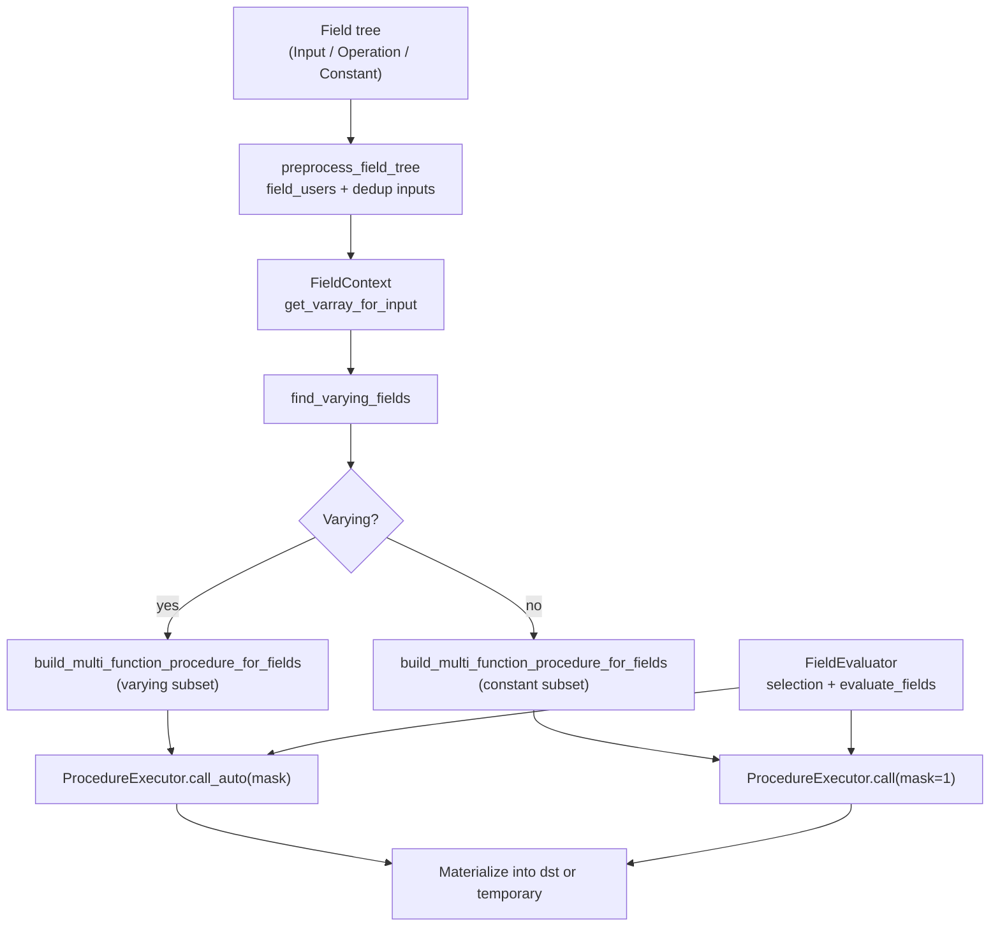

# Geometry Nodes Fields — Source-Level Notes

This note summarizes how Blender implements geometry node fields in the `fn` and `nodes` modules (commit context: current workspace). Paths referenced are relative to the repository root.

## Core concepts

- Fields are directed trees of `FieldNode` objects. Each field references one node output; dependencies are tracked via `FieldInputs` so shared inputs are deduplicated.
- Three node kinds (`source/blender/functions/FN_field.hh`):
  - `FieldInput`: provides data from the `FieldContext` (e.g. index, named/anonymous attributes).
  - `FieldOperation`: composes other fields using a `mf::MultiFunction` (owned or borrowed).
  - `FieldConstant`: stores a value buffer for constant outputs.
- Typed wrappers: `GField` (runtime typed) and `Field<T>` (compile-time typed). `FieldContext` supplies per-evaluation inputs; custom contexts override `get_varray_for_input`.
- `FieldEvaluator` orchestrates batched evaluation, optional selection masks, and output materialization.

## Important types and where to read

| Area | Key types / functions | File |
| --- | --- | --- |
| Field graph structure | `FieldNode`, `FieldInput`, `FieldOperation`, `FieldConstant`, `FieldInputs`, `FieldContext` | `source/blender/functions/FN_field.hh` |
| Evaluation helpers | `evaluate_fields`, `preprocess_field_tree`, `build_multi_function_procedure_for_fields`, `FieldEvaluator::evaluate` | `source/blender/functions/intern/field.cc` |
| Geometry node execution glue | `GeoNodeExecParams`, aliases for `FieldContext`/`FieldEvaluator`, attribute helpers | `source/blender/nodes/NOD_geometry_exec.hh` |
| Lazy-function bridge | Converts `bNodeTree` to lazy-function graph; handles attribute-only field outputs, triggers node exec | `source/blender/nodes/intern/geometry_nodes_lazy_function.cc` |

## Evaluation pipeline (from `field.cc`)

| Stage | What happens | Notes |
| --- | --- | --- |
| 1. Preprocess | `preprocess_field_tree` builds reverse edges (`field_users`) and deduplicates `FieldInput`s. | Enables backward traversal from inputs to dependents. |
| 2. Context inputs | `get_field_context_inputs` fetches `GVArray` inputs from `FieldContext`; defaults to single values when unavailable. | Context decides attribute/domain lookup. |
| 3. Short-circuit trivials | Inputs and constants are resolved immediately (`GVArray::from_single_ref`). | Avoids building procedures for already-known outputs. |
| 4. Varying detection | `find_varying_fields` walks users of non-constant inputs to tag fields needing per-element evaluation. | Anything not varying becomes "constant" and can run with mask size 1. |
| 5. Partition | Remaining outputs split into `varying` vs `constant` sets. | Drives how masks/buffers are allocated. |
| 6. Procedure build | `build_multi_function_procedure_for_fields` converts the field subgraph into an `mf::Procedure`, adding parameters for inputs and calling each node's `MultiFunction`. | Outputs unused downstream are skipped to save work. |
| 7. Execute | `ProcedureExecutor.call_auto(mask)` for varying; `call(mask=IndexMask(1))` for constants. Buffers come from provided `dst_varrays` or temporary allocations. | Mask-aware execution handles selection and sparsity. |
| 8. Materialize | Copy to caller destinations when not written in-place; destruct temps via `ResourceScope`. | Uses span copy or parallel materialize when needed. |

## `FieldEvaluator` behavior

- Constructed with a `FieldContext` and either an `IndexMask` or a size (auto-creates mask).
- Optional `set_selection(Field<bool>)`: evaluates selection first (`evaluate_selection`), producing `selection_mask_` intersected with constructor mask.
- `add_with_destination` variants let callers provide `GVMutableArray` or spans; `add` stores computed `GVArray` for later retrieval.
- `evaluate()` calls `evaluate_fields` with the selection mask; writes results into provided destinations or keeps owned `GVArray`s. Accessors include `get_evaluated`, `get_evaluated_selection_as_mask`, `get_evaluated_as_mask` (bool fields → mask).

## Geometry nodes integration (exec & lazy graph)

- `NOD_geometry_exec.hh` exposes aliases and `GeoNodeExecParams`, which wraps lazy-function params to fetch `SocketValueVariant` inputs, enforce geometry validity, and write outputs. Field-specific helpers route attribute propagation metadata.
- `geometry_nodes_lazy_function.cc` builds a lazy-function graph from the `bNodeTree`:
  - Each node becomes a `LazyFunction` (`LazyFunctionForGeometryNode`). Attribute-only field outputs can be satisfied without running the node body by emitting anonymous attribute field ids.
  - Inputs/outputs become lazy-function sockets; usage flags (`ValueUsage`) gate whether expensive inputs are requested.
  - Execution path: once inputs are ready, `GeoNodeExecParams` is constructed and `geometry_node_execute` is invoked, which typically builds/uses `FieldEvaluator` instances for field sockets.

## Dataflow overview

## Practical takeaways

- Compose fields with `FieldOperation::from(mf::MultiFunction, inputs)`; reuse `FieldInputs` to avoid duplicate input tracking.
- Provide a domain-aware `FieldContext` so `FieldInput::get_varray_for_context` can materialize attributes or generated data appropriately.
- When writing nodes, use `FieldEvaluator` to batch multiple fields with a shared context and selection; prefer `add_with_destination` to avoid copies.
- Constant fields are auto-folded when they have no input dependencies (`make_field_constant_if_possible`).
- Selections are masks; evaluating them first can shrink work for downstream field evaluations.
