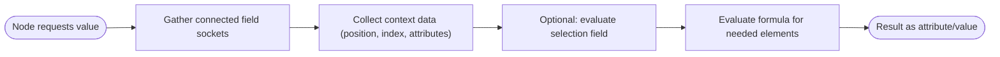

# Geometry Nodes Fields — Plain-English Guide

A field is a recipe for producing values per element (point/edge/face/instance/voxel) instead of a single stored attribute. Geometry Nodes evaluates that recipe only where needed, on the right domain, and can share the work between nodes.

## Quick answers (what/why/how/when/where)

| Question | Answer |
| --- | --- |
| What is a field? | A lazy formula that can be evaluated for each element (like “Position + Noise” per point) without storing it first. |
| Why use it? | Reduces copies, keeps setups flexible, and lets downstream nodes decide when/how much to compute. |
| How does it run? | The system builds a small function from connected field sockets, then evaluates it for the requested elements, often together to avoid duplicate work. |
| When is it evaluated? | Only when an output needs it (e.g., a node that reads the socket value). Viewer nodes or attribute writes trigger evaluation. Selection fields run first to skip unneeded elements. |
| Where does it pull data from? | From the current geometry component/domain via the field context (e.g., positions, normals, index, named or anonymous attributes). |

## Sockets: field vs. value

- **Field socket** (dashed purple): carries a recipe. It can depend on other fields and on geometry context (position, index, attributes, domain).
- **Value socket** (solid color): holds an immediate value already computed (e.g., a number node, a constant). Many nodes accept either; plugging a value into a field input turns it into a constant field.

## How a field is evaluated (simple view)

## Typical uses

- Driving per-point values (position offsets, colors, radii, noise).
- Creating selections: boolean fields that mask which elements a node should affect.
- Writing attributes: evaluate a field, then store it on a domain (e.g., "Store Named Attribute").
- Controlling instances: scale/rotation per instance using fields like Index, Position, or custom attributes.

## Mental model

- Think of a field socket as **a spreadsheet column formula**: it is not data yet; it becomes data when someone asks for it.
- Selections are **filters**: they are just boolean fields; many nodes use them to limit work.
- Domains matter: the same field can be evaluated per point, per edge, per face, or per instance depending on the consuming node.
- Anonymous attributes: some nodes pass data through fields without naming it; downstream nodes can consume it without polluting the attribute namespace.

## When to prefer fields over stored attributes

- You only need the value transiently (e.g., to drive a single node) and do not need to keep it.
- The computation depends on domain or selection and could be sparse.
- You want to reuse the same expression in multiple places without duplicating stored data.

## When to store the result

- You need to inspect or export the data (viewer, spreadsheet, export).
- Multiple later nodes need the exact same values and recomputing would be heavy.
- You are switching contexts (e.g., moving from points to instances) and want a stable attribute to read later.

## Core ingredients you’ll see in nodes

| Ingredient | Plain meaning | Examples |
| --- | --- | --- |
| Field inputs | The starting info: position, index, named attributes, anonymous attributes. | Position, Normal, Index, ID, named attribute sockets. |
| Field operations | Math/logic that combine fields. | Add, Multiply, Vector Math, Map Range, Noise. |
| Field context | Where the evaluation happens. | Current geometry component and domain determine what “Position” or “Normal” means. |
| Field evaluator | The runtime helper that batches evaluation. | Runs selections first, then computes only the needed outputs. |

## Small checklist for building node setups

- Use field sockets for per-element logic; convert to value only when you truly need a single number/vector.
- Add selections early (boolean fields) to avoid unnecessary work downstream.
- Remember domain: some nodes auto-switch; others expect a specific domain—use Domain Size/Transfer Attribute if needed.
- Store (write) attributes only when you need persistence or sharing; otherwise let fields stay lazy.
- Use Viewer or Store Named Attribute to inspect what a field produces.
